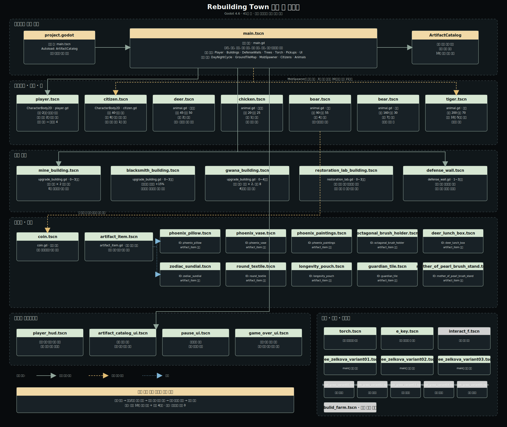

# Rebuilding Town 게임 전체 구조 분석



## 1. 프로젝트 개요

- 엔진: Godot 4.6
- 메인 씬: `main.tscn`
- 전체 씬: 41개
- 전역 시스템: `ArtifactCatalog`
- 핵심 장르 구조: 횡스크롤 액션 + 마을 재건 + 유물 수집 + 주기적 방어

현재 게임은 플레이어가 필드를 돌아다니며 동전과 손상된 유물을 얻고, 동전으로 마을 건물을 재건하며, 복원소에서 유물을 복원하는 구조다. 날짜가 지날수록 적대 몹의 비율과 위협이 증가하고 3일마다 마을 오른쪽에서 습격이 발생한다.

## 2. 핵심 게임 루프

1. 플레이어가 일반 몹과 적대 몹을 상대한다.
2. 처치한 몹에게서 동전과 아직 등록되지 않은 손상 유물이 나온다.
3. 동전으로 광산, 대장간, 관아, 유물 복원소를 단계적으로 재건한다.
4. 복원소에서 유물을 복원해 카탈로그에 등록하고 유물 효과를 얻는다.
5. 광산 수입, 대장간 공격력, 관아 주민 수용력으로 마을의 장기 전력이 증가한다.
6. 3일마다 발생하는 적대 몹 습격을 막으며 최종 승리 조건을 달성한다.

## 3. 승리와 패배

- 승리 조건: 유물 10종 전부 복원 + `gwana_building.tscn` 4단계 달성
- 패배 조건: 플레이어 체력 0
- 결과 화면: 생존 일수, 복원 유물, 건물 복구 단계, 전투 성과를 점수로 집계

## 4. 주요 시스템

### 날짜와 습격

- 하루 길이: 약 180초
- 일반 몹 생성 간격: 약 14초
- 일반 생성 개체 상한: 8마리
- 우호 몹 확률: 첫날 70%, 매일 5%p 감소, 최소 15%
- 호랑이 등장: 5일차부터
- 습격: 3일마다, 30일차까지
- 습격 수: 3마리부터 회차마다 2마리 증가, 최대 15마리
- 습격 위치: 화면 오른쪽에서 생성되어 마을 중심 방향으로 이동

### 건물 운영

| 건물 씬 | 단계 | 역할 |
|---|---:|---|
| `mine_building.tscn` | 0~3 | 매일 단계 × 2 동전 생산 |
| `blacksmith_building.tscn` | 0~3 | 단계마다 플레이어 공격력 +15% |
| `gwana_building.tscn` | 0~4 | 단계 × 2명 수용, 최대 8명 |
| `restoration_lab_building.tscn` | 0~3 | 유물 복원, 단계가 높을수록 비용·시간 감소 |
| `defense_wall.tscn` | 1~3 | 인접 건물의 복구 단계에 맞춰 외형 변화 |

공통 건물 업그레이드는 `upgrade_building.gd`가 담당하며 E키 상호작용, 비용 지불, 건설 연출, 단계 변경을 공통 처리한다.

### 주민

- 주민 씬: `citizen.tscn`
- 최대 체력: 40
- 전체 최대 인원: 8명
- 실제 수용 인원: 관아 단계 × 2명
- 주민이 사망해 결원이 생기면 매일 관아에서 1명씩 보충
- 적대 몹을 감지하면 도망치는 행동을 수행
- 주민과 몹은 같은 물리 레이어를 사용하되 서로 충돌하지 않고 통과

### 전투와 몹

| 씬 | 성향 | 체력 | 속도 | 동전 |
|---|---|---:|---:|---:|
| `chicken.tscn` | 비적대 | 20 | 25 | 1 |
| `deer.tscn` | 비적대 | 45 | 50 | 2 |
| `boar.tscn` | 적대 | 90 | 55 | 4 |
| `bear.tscn` | 적대 | 160 | 30 | 7 |
| `tiger.tscn` | 적대 | 200 | 70 | 10 |

플레이어는 기본 공격, 2연격, 찌르기를 사용한다. 몹 공통 행동은 `animal.gd`가 담당하며, 적대 몹은 플레이어 또는 주민을 추적한다. 습격 개체는 생성 직후 마을 방향 목적지를 먼저 향한다.

### 유물

- 유물 공통 부모 씬: `artifact_item.tscn`
- 개별 유물 씬: 10개
- 드롭: `animal.gd`가 아직 카탈로그에 등록되지 않은 유물 중 하나를 선택
- 운반: 플레이어 유물 슬롯 2개
- 복원: `restoration_lab_building.tscn`
- 등록·효과·저장: 전역 `ArtifactCatalog`

## 5. 씬 구조 요약

### 메인에서 직접 배치되는 씬

`player.tscn`, 건물 5종, `coin.tscn`, UI 4종, `torch.tscn`, 느티나무 3종이 `main.tscn`에 직접 배치된다.

### 실행 중 동적으로 생성되는 씬

- `citizen.tscn`: 관아 수용력과 결원 상태에 따라 생성
- 동물 5종: `mob_spawner.gd`에서 일반 생성 또는 습격 생성
- 유물 10종과 `coin.tscn`: 몹 처치 시 드롭
- `e_key.tscn`: 업그레이드 가능한 건물의 상호작용 표시로 생성

### 현재 연결되지 않은 씬

- `bulid_farm.tscn`
- `interact_f.tscn`
- `bush_grass_variant01.tscn` ~ `bush_grass_variant05.tscn`

이 씬들은 프로젝트 파일에는 존재하지만 현재 메인 씬이나 실행 스크립트에서 참조되지 않는다. 삭제 대상이라기보다 향후 농장·환경 장식 기능을 위한 후보 자원으로 보는 편이 적절하다.

## 6. 구조적 평가

### 강점

- `main.gd`가 날짜, 마을 운영, 승리 조건을 한곳에서 조율해 현재 규모에서는 흐름을 추적하기 쉽다.
- 동물은 `animal.gd`, 건물은 `upgrade_building.gd`, 유물은 `artifact_item.tscn`으로 공통화되어 변형 씬 추가가 쉽다.
- 유물 시스템이 전역 카탈로그, 필드 아이템, 플레이어 슬롯, 복원소, UI로 역할이 분리되어 있다.
- 충돌 레이어가 지형 1, 플레이어 2, 몹·주민 4로 구분되어 캐릭터끼리 밀어내지 않는 요구가 명확하게 구현되어 있다.

### 개선 우선순위

1. `main.gd`가 날짜, 건물, 주민, 승리, 점수를 모두 담당한다. 기능이 더 늘면 날짜 관리자, 마을 관리자, 결과 계산기로 분리하는 것이 좋다.
2. `defense_wall.tscn`은 현재 시각적 성장 요소에 가깝다. 습격 지연, 건물 피해 감소 등 실제 방어 기능을 연결하면 존재 이유가 강해진다.
3. 미사용 씬 7개는 사용할 계획과 폐기 계획을 구분해 정리해야 파일 탐색 혼란을 줄일 수 있다.
4. 유물 10종의 효과 강도 차이가 크므로 획득 확률과 효과 가치를 함께 검증할 필요가 있다.
5. 30일 이후에는 정기 습격이 끝나므로, 승리하지 못한 플레이가 긴장 없이 이어질 수 있다. 30일을 최종 압박 구간 또는 제한 시간으로 활용하는 설계가 필요하다.

## 7. 파일 구조

```text
rebuliding-town/
├─ project.godot
├─ main.tscn / main.gd
├─ player.tscn / player.gd
├─ citizen.tscn / citizen.gd
├─ animal.gd
├─ deer.tscn / chicken.tscn / boar.tscn / bear.tscn / tiger.tscn
├─ mob_spawner.gd
├─ *_building.tscn
├─ upgrade_building.gd / restoration_lab.gd / defense_wall.gd
├─ artifact_item.tscn / artifact_item.gd
├─ artifact_catalog.gd
├─ artifacts/
│  ├─ items/                 # 개별 유물 씬 10종
│  └─ museum_text/           # 유물 설명 자료
├─ player_hud.tscn
├─ artifact_catalog_ui.tscn
├─ pause_ui.tscn
├─ game_over_ui.tscn
├─ assets/                   # 캐릭터·건물·환경·유물 이미지
└─ tools/                    # 자동 검증 스크립트
```
